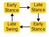

Finite State Machine Controller
================================

Overview
---------------

The library ships with three example implementations of the same finite state machine walking controller. 

The first implementation is all in Python, and it uses the ``state_machine`` modules from the controls subpackage of this library. 
If you plan to write your controllers exclusively in Python, this example would be a good place to start. 

The library also provides support for using compiled `C` and `C++` library functions via the ``compiled_controller`` modules.
You can see a very basic example usage of this module on the tutorials page, which may be helpful to walk through before starting with this example (:ref:`compiled_controller_tutorial_doc`).
The source code for the compiled controllers (C++ and MATLAB implementations) is available in `this repository
<https://github.com/neurobionics/OSL_CompiledControllers_Source>`_.
Please refer to the documentation in that repository for information on how to compile both the C++ and MATLAB source code. 

Python Implementation
-----------------------

Setup and Configuraiton 
^^^^^^^^^^^^^^^^^^^^^^^^^^^

First, we'll perform some standard imports.

.. literalinclude:: ../../examples/fsm_walking_controller.py
    :language: python
    :lines: 11-17

Next, we'll define all of the tunable FSM parameters. 
These include the impedance parameters for each state as well as the transitions between states.

.. literalinclude:: ../../examples/fsm_walking_controller.py
    :language: python
    :lines: 19-60

.. note::
    These parameters were roughly tuned for a moderately paced walking gait. 
    You may want to tune them to better suit your intended use case.

Next, we enter our main function for this script, `run_FSM_controller()`.
We first instantiate an OSL object, add the joints, and add a loadcell.

.. literalinclude:: ../../examples/fsm_walking_controller.py
    :language: python
    :lines: 63-87

.. note::
    If instantiating the OSL object is unfamiliar, check out the :ref:`adding_joints_tutorial` and :ref:`adding_loadcell_tutorial` tutorial pages.

Then, we create a `StateMachine` instance. 
We've written a helper function to do this just to keep the code tidy, 
and we'll get to that function later on. 

.. literalinclude:: ../../examples/fsm_walking_controller.py
    :language: python
    :lines: 89

Next, we configure the OSL log:

.. literalinclude:: ../../examples/fsm_walking_controller.py
    :language: python
    :lines: 91-113

Main Loop
^^^^^^^^^^^
Now that everything is set up, we will home the OSL and enter the main loop.
During each iteration of the main loop, we call the update method for both the OSL and the FSM.
We then write the current impedance parameters for each joint to the hardware.
A print statement is also included for debugging.

.. literalinclude:: ../../examples/fsm_walking_controller.py
    :language: python
    :lines: 115-169

.. note:: 
    The OSL library provides sensor values in default units. If your library expects other units,
    you need to convert the values prior to assigning them. You can use the ``units`` module in the ``tools`` subpackage to do this.
    For example you can convert from radians (the default) to degrees using ``ankle_angle_in_deg = units.convert_from_default(osl.ankle.output_position, units.position.deg)``.

Building the State Machine
^^^^^^^^^^^^^^^^^^^^^^^^^^^^^
The function ``build_4_state_FSM()`` uses the ``StateMachine`` functionality of the ``opensourceleg.control`` module to make a state machine with 4 states.
First, we create the states using the ``State`` class. 

.. literalinclude:: ../../examples/fsm_walking_controller.py
    :language: python
    :lines: 175-188

Then, we assign impedance values for each state.

.. literalinclude:: ../../examples/fsm_walking_controller.py
    :language: python
    :lines: 190-224

After the states have been defined, we define transition functions. These functions take the ``osl`` instance as arguments and return a boolean when transition criteria are met.
For example, we first define the transition from early stance to late stance based on the loadcell `z` force and the ankle angle as:

.. literalinclude:: ../../examples/fsm_walking_controller.py
    :language: python
    :lines: 226-235

The remaining transition functions are defined similarly.

.. literalinclude:: ../../examples/fsm_walking_controller.py
    :language: python
    :lines: 226-267

Next, we define events corresponding to the state transtions using the ``Event`` class.

.. literalinclude:: ../../examples/fsm_walking_controller.py
    :language: python
    :lines: 269-273

Finally, we make an instance of the ``StateMachine`` class and add the states, events, and transitions that we've created. 
The ``add_transition()`` method takes arguments of a source state, a destination state, an event, and the callback function defining when that transition occurs.
After that, the FSM is fully built and can be returned. 

.. literalinclude:: ../../examples/fsm_walking_controller.py
    :language: python
    :lines: 275-311

Finally, we call our main function:

.. literalinclude:: ../../examples/fsm_walking_controller.py
    :language: python
    :lines: 314-315

Full Code for This Example
^^^^^^^^^^^^^^^^^^^^^^^^^^^^^^

.. literalinclude:: ../../examples/fsm_walking_controller.py
    :language: python
    :linenos:

C++ and MATLAB Implementation
-----------------------------------
To get started, make sure you have compiled either the `C++` or the `MATLAB` source code and have a `FSMController.so` library. 
If not, please see the source repository for compilation instructions.
To run this example as is, copy the library you generated to the `examples` directory. 
Alternatively, you can modify the search path for the library when loading the controller (see below). 

Load Compiled Library
^^^^^^^^^^^^^^^^^^^^^

First, we'll perform standard imports, handle some paths, and setup our OSL object. 

.. literalinclude:: ../../examples/fsm_walking_compiled_controller.py
    :language: python
    :linenos:
    :lines: 11-36

.. note::
    If instantiating the OSL object is unfamiliar, check out the :ref:`adding_joints_tutorial` and :ref:`adding_loadcell_tutorial` tutorial pages.

Next, we'll instantiate a ``CompiledController`` wrapper object. This takes arguments of 
the name of the library (without extension), the path at which it is located (which in this case is the current directory),
and the names of the main, initializaiton, and cleanup functions. 

.. literalinclude:: ../../examples/fsm_walking_compiled_controller.py
    :language: python
    :linenos:
    :lines: 38-45

Define Custom Datatypes
^^^^^^^^^^^^^^^^^^^^^^^^

Next, we define the data structures used in the controller. These must exactly match (size and order) what was used to create the library.
First, we define a type for a single set of impedance parameters called ``impedance_param_type``, where `stiffness`, `damping`, and `eq_angle` are each doubles.
The ``CompiledController`` object provides building block types within its ``types`` attribute. 

.. literalinclude:: ../../examples/fsm_walking_compiled_controller.py
    :language: python
    :linenos:
    :lines: 47-54

We then define the type ``joint_impedance_set`` which contains a set of impedance parameters for each of the four states. 
Because we have already defined the ``impedance_param_type`` in the previous lines, we can now use it to define additional types. 

.. literalinclude:: ../../examples/fsm_walking_compiled_controller.py
    :language: python
    :linenos:
    :lines: 55-63

We then similarly define the ``transition_parameters`` type as well as the overall ``UserParameters`` type.

.. literalinclude:: ../../examples/fsm_walking_compiled_controller.py
    :language: python
    :linenos:
    :lines: 64-85

We also define a sensors type. We're using the default sensors, which the ``CompiledController`` class provides in list form already setup correctly. 

.. literalinclude:: ../../examples/fsm_walking_compiled_controller.py
    :language: python
    :linenos:
    :lines: 86

The final type definitions are for the input and output types. 

.. literalinclude:: ../../examples/fsm_walking_compiled_controller.py
    :language: python
    :linenos:
    :lines: 88-102

Configure Impedance and Transition Parameters 
^^^^^^^^^^^^^^^^^^^^^^^^^^^^^^^^^^^^^^^^^^^^^^^
The next section of code configures the impedance and transition paramters based on a pre-defined tuning.
Feel free to play with these values to get the behavior you want.

.. literalinclude:: ../../examples/fsm_walking_compiled_controller.py
    :language: python
    :linenos:
    :lines: 105-140

Main Loop
^^^^^^^^^^^

Now that the controller is configured, we can home the osl, calibrate the loadcell, set both joints to impedance mode, and begin running. 
Note that within the main loop after calling ``osl.update()``, we assign the relevant sensor values from the ``osl`` object to the controller inputs. 
We also write to any other inputs that change every loop, such as the current time ``t``. 
Once all inputs are assigned, we call the ``run()`` method, which calls our compiled library with the configured inputs.
The run method returns the outputs object, which is populated by the compiled library function. 

.. literalinclude:: ../../examples/fsm_walking_compiled_controller.py
    :language: python
    :linenos:
    :lines: 142-176

.. note:: 
    The OSL library provides sensor values in default units. If your library expects other units,
    you need to convert the values prior to assigning them. You can use the ``units`` module in the ``tools`` subpackage to do this.
    For example you can convert from radians (the default) to degrees using ``ankle_angle_in_deg = units.convert_from_default(osl.ankle.output_position, units.position.deg)``.

Finally, we write from the outputs structure to the hardware.
Be careful with units at this step as well, making sure your values are either in default 
units, or that you call appropriate conversion functions. As our library was in degrees, 
we convert to radians. 

.. literalinclude:: ../../examples/fsm_walking_compiled_controller.py
    :language: python
    :linenos:
    :lines: 179-204

Full Code for This Example
^^^^^^^^^^^^^^^^^^^^^^^^^^^^^^^^^^^^^^

.. literalinclude:: ../../examples/fsm_walking_compiled_controller.py
    :language: python
    :linenos: