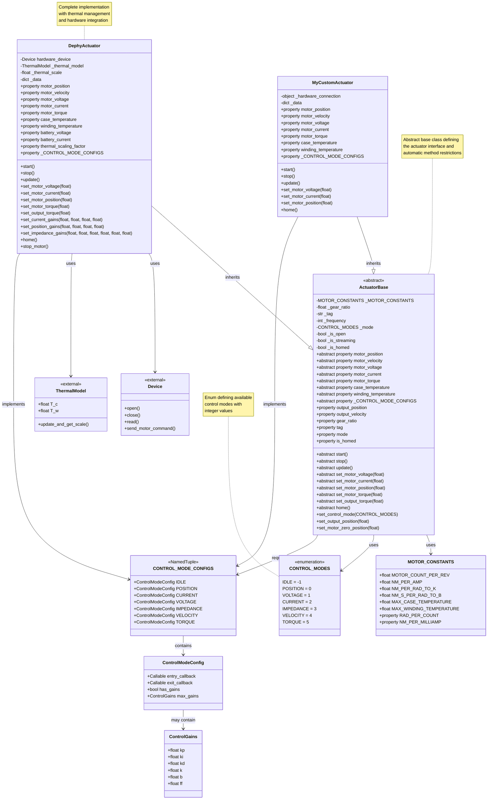

# Extending the Actuators Module

## Overview

The actuators module currently supports multiple actuators for the Open-Source Leg Project, and acts as a template for extending the module to support new actuators.

The following diagram shows the key components and relationships in the actuators module:



This documentation mainly focuses on how to extend the **actuators** module to support new actuators.

---

## 1. Import base components

```python
from opensourceleg.actuators.base import (
    CONTROL_MODE_CONFIGS,
    CONTROL_MODES,
    MOTOR_CONSTANTS,
    ActuatorBase,
    ControlGains,
    ControlModeConfig,
)
```

These components are used to define the control modes, motor constants, and to initialize a custom actuator class.

---

## 2. Understanding Motor Constants

Before configuring control modes, you need to define the motor constants for your actuator. These constants define the physical characteristics and limits of your motor:

```python
from opensourceleg.actuators.base import MOTOR_CONSTANTS

MY_MOTOR_CONSTANTS = MOTOR_CONSTANTS(
    MOTOR_COUNT_PER_REV=16384,      # Encoder counts per revolution
    NM_PER_AMP=0.14,                # Torque constant (Nm per Amp)
    NM_PER_RAD_TO_K=2047.5,         # Conversion factor for stiffness gains
    NM_S_PER_RAD_TO_B=26.25,        # Conversion factor for damping gains
    MAX_CASE_TEMPERATURE=80.0,      # Maximum case temperature (°C)
    MAX_WINDING_TEMPERATURE=110.0   # Maximum winding temperature (°C)
)
```

---

## 3. Defining/Customizing Predefined Control Modes

The actuators module currently offers the following control mode flags:

| Control Mode | Value | Description                          |
| ------------ | ----- | ------------------------------------ |
| IDLE         | -1    | No active control, motor is inactive |
| POSITION     | 0     | Position control mode                |
| VOLTAGE      | 1     | Direct voltage control mode          |
| CURRENT      | 2     | Current/torque control mode          |
| IMPEDANCE    | 3     | Impedance control mode               |
| VELOCITY     | 4     | Velocity control mode                |
| TORQUE       | 5     | Torque control mode                  |

These flags are used to put the actuator into a specific control mode. We highly recommend using these default flags for your custom actuator to make it compatible with the default functionality in the actuators module.

### Configuring Control Mode Configs

Each control mode can be configured using `ControlModeConfig` and `CONTROL_MODE_CONFIGS`. Each mode can specify entry/exit callbacks and gain limits. Here's a practical example based on the Dephy implementation:

```python
import time
from opensourceleg.logging import LOGGER

def entry_voltage_mode(actuator):
    LOGGER.debug(f"[{actuator.tag}] Entering VOLTAGE mode.")

def exit_voltage_mode(actuator):
    LOGGER.debug(f"[{actuator.tag}] Exiting VOLTAGE mode.")
    actuator.stop_motor()  # Safety: stop motor when exiting
    time.sleep(0.1)

def entry_current_mode(actuator):
    LOGGER.debug(f"[{actuator.tag}] Entering CURRENT mode.")

def exit_current_mode(actuator):
    LOGGER.debug(f"[{actuator.tag}] Exiting CURRENT mode.")
    actuator.stop_motor()
    time.sleep(0.1)

MY_CONTROL_MODE_CONFIGS = CONTROL_MODE_CONFIGS(
    VOLTAGE=ControlModeConfig(
        entry_callback=entry_voltage_mode,
        exit_callback=exit_voltage_mode,
        has_gains=False,
        max_gains=None,
    ),
    CURRENT=ControlModeConfig(
        entry_callback=entry_current_mode,
        exit_callback=exit_current_mode,
        has_gains=False,
        max_gains=ControlGains(kp=80, ki=800, kd=0, k=0, b=0, ff=128),
    ),
    POSITION=ControlModeConfig(
        entry_callback=lambda actuator: LOGGER.debug(f"[{actuator.tag}] Entering POSITION mode."),
        exit_callback=lambda actuator: (LOGGER.debug(f"[{actuator.tag}] Exiting POSITION mode."),
                                       actuator.stop_motor(), time.sleep(0.1)),
        has_gains=False,
        max_gains=ControlGains(kp=1000, ki=1000, kd=1000, k=0, b=0, ff=0),
    ),
    IMPEDANCE=ControlModeConfig(
        entry_callback=lambda actuator: LOGGER.debug(f"[{actuator.tag}] Entering IMPEDANCE mode."),
        exit_callback=lambda actuator: (LOGGER.debug(f"[{actuator.tag}] Exiting IMPEDANCE mode."),
                                       actuator.stop_motor(), time.sleep(0.1)),
        has_gains=False,
        max_gains=ControlGains(kp=80, ki=800, kd=0, k=1000, b=1000, ff=128),
    ),
)
```

You can then link these configs to your custom actuator class using the `_CONTROL_MODE_CONFIGS` property.

## 4. Defining and Integrating Custom Control Modes

> **Note:** Python's `enum.Enum` does _not_ support extension by subclassing.
> To add custom modes, define a new Enum containing all the original modes plus your custom ones.

**Example: Adding a CUSTOM Mode**

```python
from enum import Enum

class MY_CONTROL_MODES(Enum):
    IDLE = -1
    POSITION = 0
    VOLTAGE = 1
    CURRENT = 2
    IMPEDANCE = 3
    VELOCITY = 4
    TORQUE = 5
    CUSTOM = 100  # Your custom mode -- assign a unique integer
```

Make sure your control logic, configs, and actuator class use your custom Enum everywhere a mode is referenced.

```python
def entry_custom_mode(actuator):
    LOGGER.info(f"[{actuator.tag}] Entering CUSTOM mode.")
    # Add any custom initialization logic here

def exit_custom_mode(actuator):
    LOGGER.info(f"[{actuator.tag}] Exiting CUSTOM mode.")
    # Add any custom cleanup logic here

# Note: Since CONTROL_MODE_CONFIGS doesn't support custom fields,
# you'll need to extend it or handle custom modes separately
MY_CONTROL_MODE_CONFIGS = CONTROL_MODE_CONFIGS(
    # Include all standard modes...
    VOLTAGE=ControlModeConfig(...),
    CURRENT=ControlModeConfig(...),
    # etc.
)

# Handle custom mode separately in your actuator's set_control_mode method
```

---

## 5. Implementing a Custom Actuator Class with `ActuatorBase`

To add a new actuator, **subclass `ActuatorBase`** and implement all required abstract methods and properties. The class should also expose the `_CONTROL_MODE_CONFIGS` property that returns your mode configuration.

**Example: Complete Template for a Custom Actuator**

```python
from typing import Optional
from opensourceleg.actuators.base import ActuatorBase, CONTROL_MODES
from opensourceleg.logging import LOGGER
from opensourceleg.math import ThermalLimitException

class MyActuator(ActuatorBase):
    """
    Example actuator implementation following the Dephy pattern.

    Example usage:
        >>> actuator = MyActuator(tag="motor1", port="/dev/ttyUSB0", gear_ratio=100.0)
        >>> actuator.start()
        >>> actuator.set_control_mode(CONTROL_MODES.VOLTAGE)
        >>> actuator.set_motor_voltage(1500)
        >>> print(f"Motor position: {actuator.motor_position:.2f} rad")
        >>> actuator.stop()
    """
    def __init__(
        self,
        tag: str = "MyActuator",
        port: str = "/dev/ttyUSB0",
        gear_ratio: float = 100.0,
        frequency: int = 500,
        offline: bool = False,
    ):
        super().__init__(
            tag=tag,
            gear_ratio=gear_ratio,
            motor_constants=MY_MOTOR_CONSTANTS,
            frequency=frequency,
            offline=offline,
        )
        self.port = port
        self._data = None  # Store current actuator data

        # Initialize your hardware-specific attributes here
        self._hardware_connection = None

    @property
    def _CONTROL_MODE_CONFIGS(self):
        return MY_CONTROL_MODE_CONFIGS

    def start(self) -> None:
        """Start the actuator and establish communication."""
        try:
            # Initialize hardware connection
            LOGGER.info(f"[{self.tag}] Starting actuator on port {self.port}")

            # Your hardware-specific initialization code here
            # Example: self._hardware_connection = open_connection(self.port)

            self._is_open = True
            self._is_streaming = True

            # Read initial data
            self.update()

            # Set initial control mode
            self.set_control_mode(CONTROL_MODES.VOLTAGE)

        except Exception as e:
            LOGGER.error(f"[{self.tag}] Failed to start actuator: {e}")
            raise

    def stop(self) -> None:
        """Stop the actuator and close communication."""
        try:
            # Safety: stop motor first
            if hasattr(self, 'stop_motor'):
                self.stop_motor()

            # Set to idle mode
            self.set_control_mode(CONTROL_MODES.IDLE)

            # Close hardware connection
            # Example: self._hardware_connection.close()

            self._is_streaming = False
            self._is_open = False

            LOGGER.info(f"[{self.tag}] Actuator stopped")

        except Exception as e:
            LOGGER.error(f"[{self.tag}] Error stopping actuator: {e}")

    def update(self) -> None:
        """Update actuator data from hardware."""
        if not self._is_streaming:
            return

        try:
            # Read data from hardware
            # Example: self._data = self._hardware_connection.read()

            # Check for thermal limits (similar to Dephy implementation)
            if self.case_temperature >= self.max_case_temperature:
                LOGGER.error(f"[{self.tag}] Case thermal limit exceeded: {self.case_temperature}°C")
                raise ThermalLimitException()

            if self.winding_temperature >= self.max_winding_temperature:
                LOGGER.error(f"[{self.tag}] Winding thermal limit exceeded: {self.winding_temperature}°C")
                raise ThermalLimitException()

        except Exception as e:
            LOGGER.error(f"[{self.tag}] Error updating actuator data: {e}")

    def set_motor_voltage(self, value: float) -> None:
        """Set motor voltage in mV."""
        if not self._is_streaming:
            LOGGER.warning(f"[{self.tag}] Cannot set voltage - actuator not streaming")
            return

        # Your hardware-specific voltage setting code here
        # Example: self._hardware_connection.send_voltage_command(int(value))
        LOGGER.debug(f"[{self.tag}] Setting motor voltage to {value} mV")

    def set_motor_current(self, value: float) -> None:
        """Set motor current in mA."""
        if not self._is_streaming:
            LOGGER.warning(f"[{self.tag}] Cannot set current - actuator not streaming")
            return

        # Your hardware-specific current setting code here
        LOGGER.debug(f"[{self.tag}] Setting motor current to {value} mA")

    def set_motor_position(self, value: float) -> None:
        """Set motor position in radians."""
        if not self._is_streaming:
            LOGGER.warning(f"[{self.tag}] Cannot set position - actuator not streaming")
            return

        # Convert to hardware units and send command
        position_counts = int((value + self.motor_zero_position) / self.MOTOR_CONSTANTS.RAD_PER_COUNT)
        # Example: self._hardware_connection.send_position_command(position_counts)
        LOGGER.debug(f"[{self.tag}] Setting motor position to {value} rad ({position_counts} counts)")

    def set_motor_torque(self, value: float) -> None:
        """Set motor torque in Nm."""
        # Convert torque to current using motor constant
        current_ma = value / self.MOTOR_CONSTANTS.NM_PER_MILLIAMP
        self.set_motor_current(current_ma)

    def set_output_torque(self, value: float) -> None:
        """Set output torque in Nm."""
        motor_torque = value / self.gear_ratio
        self.set_motor_torque(motor_torque)

    def set_current_gains(self, kp: float, ki: float, kd: float, ff: float) -> None:
        """Set current control gains."""
        # Your hardware-specific gain setting code here
        LOGGER.debug(f"[{self.tag}] Setting current gains: kp={kp}, ki={ki}, kd={kd}, ff={ff}")

    def set_position_gains(self, kp: float, ki: float, kd: float, ff: float) -> None:
        """Set position control gains."""
        # Your hardware-specific gain setting code here
        LOGGER.debug(f"[{self.tag}] Setting position gains: kp={kp}, ki={ki}, kd={kd}, ff={ff}")

    def set_impedance_gains(self, kp: float, ki: float, kd: float, k: float, b: float, ff: float) -> None:
        """Set impedance control gains."""
        # Your hardware-specific gain setting code here
        LOGGER.debug(f"[{self.tag}] Setting impedance gains: kp={kp}, ki={ki}, kd={kd}, k={k}, b={b}, ff={ff}")

    def home(
        self,
        homing_voltage: int = 2000,
        homing_frequency: Optional[int] = None,
        homing_direction: int = -1,
        output_position_offset: float = 0.0,
        current_threshold: int = 5000,
        velocity_threshold: float = 0.001,
    ) -> None:
        """Home the actuator to find its zero position."""
        LOGGER.info(f"[{self.tag}] Starting homing sequence")

        # Implementation following Dephy pattern
        # Set voltage mode for homing
        self.set_control_mode(CONTROL_MODES.VOLTAGE)

        # Apply homing voltage
        self.set_motor_voltage(homing_direction * homing_voltage)

        # Monitor for hard stop (simplified version)
        # you can have a loop checking velocity and current thresholds, or use the home method in the base class

        # Set zero position
        self.set_motor_zero_position(self.motor_position + output_position_offset * self.gear_ratio)
        self._is_homed = True

        LOGGER.info(f"[{self.tag}] Homing complete")

    # Required property implementations
    @property
    def motor_position(self) -> float:
        """Get motor position in radians."""
        if self._data is not None:
            # Convert from hardware units to radians
            raw_position = self._data.get('position', 0)
            return float(raw_position * self.MOTOR_CONSTANTS.RAD_PER_COUNT) - self.motor_zero_position
        return 0.0

    @property
    def motor_velocity(self) -> float:
        """Get motor velocity in rad/s."""
        if self._data is not None:
            return float(self._data.get('velocity', 0))
        return 0.0

    @property
    def motor_voltage(self) -> float:
        """Get motor voltage in mV."""
        if self._data is not None:
            return float(self._data.get('voltage', 0))
        return 0.0

    @property
    def motor_current(self) -> float:
        """Get motor current in mA."""
        if self._data is not None:
            return float(self._data.get('current', 0))
        return 0.0

    @property
    def motor_torque(self) -> float:
        """Get motor torque in Nm."""
        return self.motor_current * self.MOTOR_CONSTANTS.NM_PER_MILLIAMP

    @property
    def case_temperature(self) -> float:
        """Get case temperature in °C."""
        if self._data is not None:
            return float(self._data.get('case_temp', 25.0))
        return 25.0

    @property
    def winding_temperature(self) -> float:
        """Get estimated winding temperature in °C."""
        # You might implement a thermal model here like in Dephy
        return self.case_temperature + 10.0  # Simplified estimation

    def stop_motor(self) -> None:
        """Emergency stop the motor."""
                 self.set_motor_voltage(0)
```

### Usage Example

```python
from opensourceleg.utilities import SoftRealtimeLoop

# Create and use your custom actuator
actuator = MyActuator(
    tag="knee_motor",
    port="/dev/ttyUSB0",
    gear_ratio=50.0,
    frequency=1000
)

clock = SoftRealtimeLoop(dt=1/actuator.frequency)

with actuator:
    # Example: Current control
    actuator.set_control_mode(CONTROL_MODES.CURRENT)
    actuator.set_current_gains(kp=40, ki=400, kd=0, ff=128)

    # Main control loop
    for t in clock:
        actuator.update()  # Read new data
        actuator.set_motor_current(1000)  # Apply 1000 mA

        # Your control logic here
        current_position = actuator.motor_position
        current_torque = actuator.motor_torque

        # Check temperatures
        if actuator.case_temperature > 70:
            print(f"Warning: High case temperature: {actuator.case_temperature}°C")

```

---

## 6. Understanding Method Restrictions by Control Mode

The actuators framework automatically restricts which methods can be called in each control mode. This is a safety feature that prevents inappropriate commands from being sent to the actuator.

### How It Works

- **Automatic Enforcement**: The `ActuatorBase` class has a predefined mapping of methods to their allowed control modes
- **Runtime Checking**: When you change control modes, the base class automatically enables/disables methods
- **Safety**: Attempting to call a restricted method raises a `ControlModeException`

### Predefined Method Restrictions

The following methods are automatically restricted based on control mode:

| Method                 | Allowed Control Modes |
| ---------------------- | --------------------- |
| `set_motor_voltage`    | VOLTAGE               |
| `set_motor_current`    | CURRENT               |
| `set_motor_position`   | POSITION, IMPEDANCE   |
| `set_output_position`  | POSITION, IMPEDANCE   |
| `set_motor_impedance`  | IMPEDANCE             |
| `set_output_impedance` | IMPEDANCE             |
| `set_motor_torque`     | CURRENT, TORQUE       |
| `set_output_torque`    | CURRENT, TORQUE       |
| `set_current_gains`    | CURRENT, TORQUE       |
| `set_position_gains`   | POSITION              |
| `set_impedance_gains`  | IMPEDANCE             |

### Example Behavior

```python
actuator = MyActuator()
actuator.start()

# This works - VOLTAGE mode is set by default in start()
actuator.set_motor_voltage(1500)

# This will raise ControlModeException - not in CURRENT mode
try:
    actuator.set_motor_current(1000)
except ControlModeException as e:
    print(f"Error: {e}")

# Switch to CURRENT mode, now current commands work
actuator.set_control_mode(CONTROL_MODES.CURRENT)
actuator.set_motor_current(1000)  # This works now

# But voltage commands are now restricted
try:
    actuator.set_motor_voltage(1500)  # This will raise ControlModeException
except ControlModeException as e:
    print(f"Error: {e}")
```

### Adding Custom Method Restrictions

If you need to add restrictions for custom methods, you can extend the `_METHOD_REQUIRED_MODES` class variable:

```python
class MyActuator(ActuatorBase):
    # Extend the base class restrictions
    _METHOD_REQUIRED_MODES = {
        **ActuatorBase._METHOD_REQUIRED_MODES,
        "my_custom_method": {CONTROL_MODES.VOLTAGE, CONTROL_MODES.CURRENT},
    }

    def my_custom_method(self):
        # This method will only work in VOLTAGE or CURRENT modes
        pass
```

---

### Key Base Components

- **`MOTOR_CONSTANTS`**: Dataclass defining motor physical characteristics and limits
- **`CONTROL_MODES`**: Enum defining available control modes (-1 to 5)
- **`ControlGains`**: Dataclass for control gains (kp, ki, kd, k, b, ff)
- **`ControlModeConfig`**: Configuration for each control mode (callbacks, gains, limits)
- **`CONTROL_MODE_CONFIGS`**: Named tuple containing all mode configurations
- **`ActuatorBase`**: Abstract base class defining the actuator interface

### Key Implementation Patterns

1. **Initialization**: Always call `super().__init__()` with required parameters
2. **Safety**: Implement thermal monitoring and emergency stops
3. **Data Management**: Store hardware data in `self._data` and check for None
4. **Logging**: Use the opensourceleg logging system for consistent output
5. **Error Handling**: Use try/except blocks and raise appropriate exceptions
6. **Mode Transitions**: Implement entry/exit callbacks for mode-specific setup/cleanup

### Other less enforced patterns that are good to follow

- Always check `self._is_streaming` before sending commands
- Convert between hardware units and standard units (radians, Nm, etc.)
- Implement thermal monitoring to prevent hardware damage
- Use `self.motor_zero_position` for position offset management
- Handle hardware connection failures gracefully

### Example Actuator Implementations

Study these implementations for real-world examples:

- **[DephyActpack](./dephy.py)**: Complete implementation for Dephy actuators with thermal management
- **[Moteus Controller](./moteus.py)**: Implementation for Moteus controllers
- **[TMotor](./tmotor.py)**: Implementation for TMotor actuators

### Issues and Support

Found a bug or have a suggestion? Please [open an issue](https://github.com/neurobionics/opensourceleg/issues).
