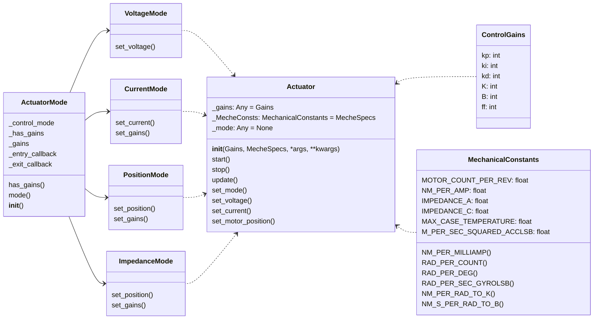

# [Actuators Base Library](./base.py) Guide

## Introduction

The actuators library contains a [`base.py`](./base.py), an abstract base for customizing your own actuator library, and examples of applications such as [`dephy.py`](./dephy.py).

## Customization Guide of Actuators Module

1. Import base module

    ```Python
    import opensourceleg.hardware.actuators.base as base
    ```

2. Customize the Modes of Actuators from `base.ActuatorMode`
    
    `VoltageMode`, `CurrentMode`, `PositionMode`, and `ImpedanceMode` are predefined for common use. 

    For example, when customizing `class VoltageMode`: 

    ```Python
    class VoltageMode(base.VoltageMode):
        def __init__(self, device: "DephyActpack") -> None:

            super().__init__(mode_pass, device=device)       # Inherit the steps from the template are suggested, as they connects to class Actuator
            <!-- Should implement your own steps below -->
        

        def set_voltage(self, voltage_value: int) -> None:
            <!-- Should implement your own steps below -->   # Link the method to actuator operations
    ```

    Or customizing from `class ActuatorMode` if new modes are needed:
    ```Python
    class TorqueMode(base.ActuatorMode)
        def __init__(self, device: "DephyActpack") -> None:

            super().__init__(mode_pass, device=device)       # Inherit the steps from the template are suggested, as they connects to class Actuator
            <!-- Should implement your own steps below -->
        
        <!-- Should implement your own steps below -->       # Link the method to actuator operations
    ```

3. Customize the actuator object from `base.Actuator`

    For example, when customizing `class VoltageMode`: 

    ```Python
    class Motor(base.Actuator):                                             # Should also inherit device class provided by your actuator manufacturer
    
        def __init__(
            self,
            name: str = "DephyActpack",
            port: str = "/dev/ttyACM0",
            baud_rate: int = 230400,
            frequency: int = 500,
            logger: Logger = Logger(),
            debug_level: int = 0,
            dephy_log: bool = False,
            *args,
            **kwargs,
        ) -> None:
            base.Actuator.__init__(
                self,
                Gains=base.ControlGains(),
                MecheSpecs=base.MecheConsts(),
            )                                                               # Inherit the steps from the template are suggested, as they offer common member definitions
    
            <!-- Should implement your own steps below -->
    
        def __repr__(self) -> str:
            return f"DephyActpack[{self._name}]"
    
        def start(self) -> None:
            super().start()
            <!-- Should implement your own steps below -->
    
        def stop(self) -> None:
            super().stop()
            <!-- Should implement your own steps below -->
    
        def update(self) -> None:
            super().update()
            <!-- Should implement your own steps below -->
    
        def set_mode(self, mode: base.ActuatorMode) -> None:
            <!-- Should implement your own steps below -->
    
        def set_voltage(self, voltage_value: float):
            <!-- Should implement your own steps below -->
    
        def set_current(
            self,
            current_value: float,
        ):
            <!-- Should implement your own steps below -->
    
        <!-- Should implement your own methods, properties, etc, below -->
    
    ```

## Reference: Base Class Structure Diagram


